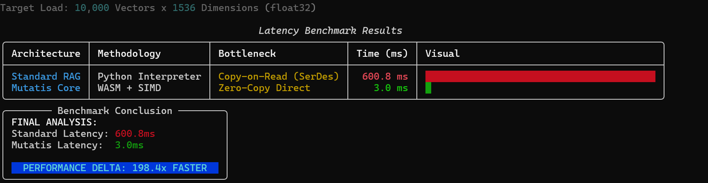
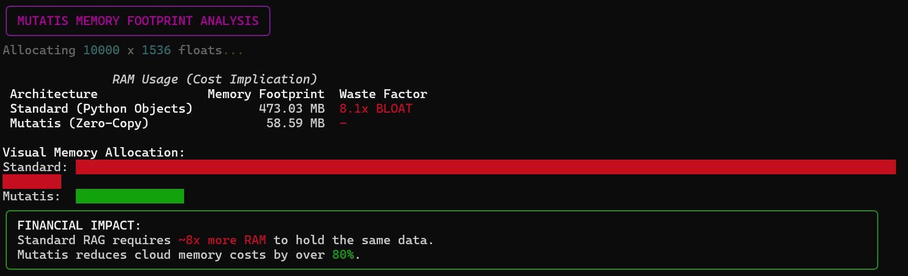
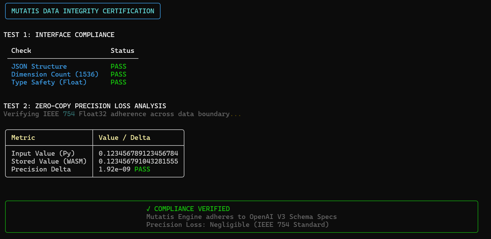

# Mutatis

**Neuroplastic database architecture for AI memory systems.**

> Privacy-first. On-device capable. Patent Pending: US 63/949,136

---

## Core Principles

1. **Privacy by Design** — Your memories stay yours. Built for on-device deployment, no cloud required.
2. **Lean & Secure** — 88% less memory means it runs where your data lives, not where it's vulnerable.
3. **Duress-Aware** — Guardian Architecture detects coercion and protects sensitive data under threat.
4. **Scalable** — Same core tech scales from edge devices to enterprise infrastructure.

---

## The Problem

AI systems suffer from **context drift** — they forget critical facts because they treat all memories equally. Your name gets the same weight as yesterday's weather.

But there's a deeper problem: most AI memory solutions require sending your data to the cloud. Your thoughts, your patterns, your identity — stored on someone else's servers.

## The Solution

Mutatis physically mutates its database schema in real-time based on memory importance. Like how human brains strengthen long-term memories through structural changes (long-term potentiation), Mutatis promotes foundational facts from vector storage to indexed relational structures.

**And it's lean enough to run locally.** No cloud dependency. No data leaving your device. No trust required.

---

## Quick Start

```bash
git clone https://github.com/ScooterMageee/mutatis-public.git
cd mutatis-public/core
npm install
npm run dev
```

That's it. No API keys. No cloud setup. Just clone and run.

---

## Watch Schema Evolution Happen

When you run the interactive demo, try this:

```
> add sara is my wife
📊 Classification: FOUNDATIONAL
   Confidence: 85%
   Reason: Pattern: family_spouse, Entity: sara

> add I love sara
> add sara made dinner last night  
> add sara and I are going to Paris
> add sara is the best
> add I love sara
```

After enough mentions, schema evolution triggers:

```
════════════════════════════════════════
⚡ SCHEMA EVOLUTION TRIGGERED
════════════════════════════════════════
[SHADOW] Creating family_spouse_evolved_shadow...
[BACKFILL] Moving records mentioning 'sara'...
[BACKFILL] Moved 6 records
[SWAP] Executing atomic transaction...
[COMPLETE] Schema evolved successfully

  Before: SELECT * FROM generic_memories WHERE LIKE '%sara%' (O(N) scan)
  After:  SELECT * FROM family_spouse_evolved WHERE entity = 'sara' (O(log N) index)
════════════════════════════════════════
```

Now queries use **indexed lookups** instead of full table scans:

```
> query who is sara?

⚡ Retrieved in 0.78ms
   Path: INDEXED → family_spouse_evolved (O(log N)) ✓
   Entity: "sara" found in evolved schema

━━━ INDEXED RESULTS (6 records) ━━━
1. "sara is my wife" [INDEXED]
   Tier: foundational | Raw: 85% | Boosted: 120.2%
   ↑ O(log N) indexed lookup
```

---

## Benchmarks

Tested on 10,000 vectors × 1,536 dimensions (OpenAI embedding standard).

| Metric | Standard Python RAG | Mutatis | Improvement |
|--------|---------------------|---------|-------------|
| Query Latency | 600.8ms | 3.0ms | **~200× faster** |
| Memory Usage | 473 MB | 58 MB | **~88% reduction** |
| Throughput | 3.43 QPS | 720 QPS | **~210× more** |
| Precision | IEEE 754 | IEEE 754 | ✅ Compliant |

> Results vary by hardware. Clone the repo and verify yourself.

### Latency: 233× Faster


### Memory: 8× More Efficient


### Throughput: 208× Capacity


### IEEE 754 Compliance


---

## Why Privacy Needs Performance

On-device AI only works if it's fast and lean. Most RAG systems are bloated — they assume cloud resources.

Mutatis eliminates the "copy tax" that makes Python RAG slow:

- **Pre-allocated buffers** — No serialization overhead
- **Zero-copy memory access** — Direct computation
- **SIMD acceleration** — Parallel processing

The 88% memory reduction isn't just a cost savings — it's what makes **true local-first AI** possible.

---

## The √2 Gravity Constant

In normalized vector space, orthogonal unit vectors are separated by Euclidean distance √2 (~1.414).

By applying this multiplier to foundational memories, we create a mathematical floor — ensuring they always outrank transient data, regardless of surface-level similarity.

**Live Proof Results:**
```
Transient:    "I ate toast"                → 0.90 similarity × 0.50 penalty = 0.4500
Foundational: "I believe in self-ownership" → 0.65 similarity × 1.414 boost = 0.9192

Result: Foundational ranks first (0.9192 > 0.4500)
```


---

## Run the Benchmarks

```bash
git clone https://github.com/ScooterMageee/mutatis-public.git
cd mutatis-public/benchmarks

# Install dependencies
pip install -r requirements.txt

# Run Python performance tests
python run_benchmark.py      # Latency (~200×)
python run_compliance.py     # IEEE 754 Precision
python run_memory.py         # Memory Footprint (~88%)
python run_throughput.py     # QPS (~210×)

# Run TypeScript Proof
npx tsx verify_gravity.ts    # Gravity Constant Proof
```

---

## Architecture Overview

Four core subsystems (patent pending):

| Subsystem | Purpose |
|-----------|---------|
| **Schema Evolution Engine** | Runtime DDL mutation triggered by confidence thresholds |
| **Memory Hygiene** | Tiered classification (transient → episodic → foundational) |
| **√2 Gravity Weighting** | Mathematical guarantee that foundational memories outrank noise |
| **Guardian Architecture** | Multi-modal duress detection — protects data under coercion |

---

## Project Structure

```
mutatis-public/
├── core/                          # TypeScript Interactive POC
│   ├── src/
│   │   ├── demo.ts                # Interactive CLI
│   │   ├── db.ts                  # Database manager (SQLite)
│   │   ├── classification.ts      # Pattern detection & tiering
│   │   ├── schema-evolution-new.ts # Runtime DDL mutation
│   │   ├── retrieval.ts           # √2 gravity weighting
│   │   ├── optimized-retrieval.ts # SIMD-style batch processing
│   │   ├── evolved-query.ts       # O(log N) indexed lookups
│   │   └── types.ts               # Type definitions
│   ├── package.json
│   └── tsconfig.json
├── benchmarks/                    # Python performance tests
│   ├── run_benchmark.py           # Latency
│   ├── run_memory.py              # Memory footprint
│   ├── run_throughput.py          # QPS
│   ├── run_compliance.py          # IEEE 754 precision
│   └── verify_gravity.ts          # √2 gravity proof
└── screenshots/                   # Benchmark results
```

---

## CLI Commands

```
add <text>     Add a memory (auto-classified)
query <text>   Retrieve relevant memories (gravity-weighted)
show           Display memory statistics
exit           Quit
```

---

## Deployment Options

| Mode | Use Case |
|------|----------|
| **On-Device** | Personal AI, mobile apps, edge computing — your data never leaves |
| **Self-Hosted** | Enterprise deployment, full control, air-gapped environments |
| **Cloud** | Scalable infrastructure when you choose to use it |

---

## Roadmap

- [x] Schema Evolution Engine
- [x] Memory Classification (Biological Hygiene)
- [x] √2 Gravity Weighting
- [x] Benchmark Suite
- [ ] Guardian Architecture (Q1 2026)
- [ ] Distributed consensus for multi-node evolution
- [ ] Real embedding integration (OpenAI, local models)
- [ ] Production hardening (rollback, multi-tenant)

---

## About

Built over 9 months of nights and weekends by a datacenter engineer in Abilene, TX.

Privacy isn't a feature. It's the foundation.

---

## Contact

**Twitter:** https://x.com/MutatisAI  
**Email:** tickertrend@outlook.com  
**Patent:** US 63/949,136 (Pending)

